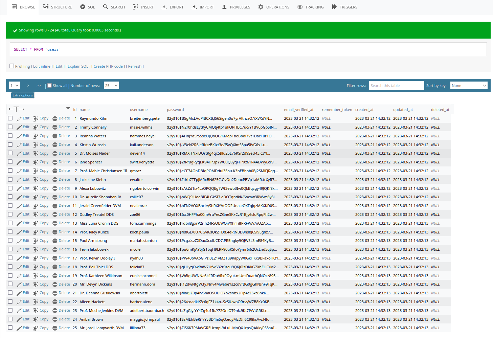
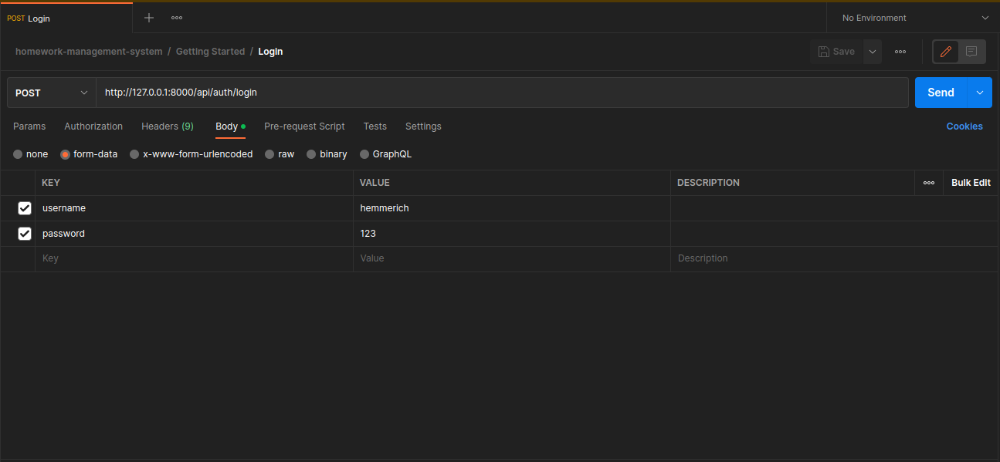

# homework-management-system

This is a homework managment system with only api for the following modules only.
1. Student
2. Teacher
3. Homework
4. HomeworkAssignment

# Setup
Clone the repo or download the zip file and extract the code
```
git clone https://github.com/MarcusLEK/homework-management-system.git
```
Create a database on your local called `laravel` and connect to it

CD into the code root directory and run the following command:

<b>Note: If you are not using virtual host, please ensure `php artisan serve` is running at all times during development/testing on a seperate terminal</b>
```
composer install
npm install
php artisan migrate:fresh
php artisan db:seed
php artisan serve
```

Optionally, you can run the seeder with the following command:

</b>Note: The homework and homework assignment model is not seeded by default</b>
```
php artisan db:seed --class=HomeworkSeeder
php artisan db:seed --class=HomeworkAssignmentSeeder
```

# Postman
1. make sure the server is up and running before you test with postman
2. login with either the student or teacher account and replace the bearer token in the collection Auth tab.

<b>Note: the data shown in the image may differ from the db due to the seed. Password for all accounts is <u>123</u></b>

 

 

 

## Known Issues
1. No policy is implemented, therefore any teachers can update/delete other teacher homework and homework assignment.